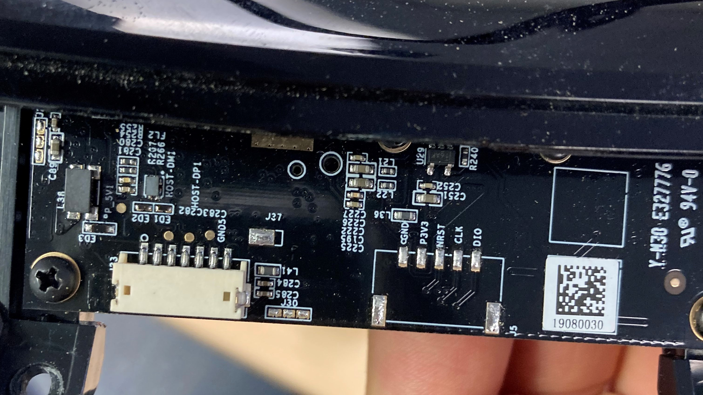
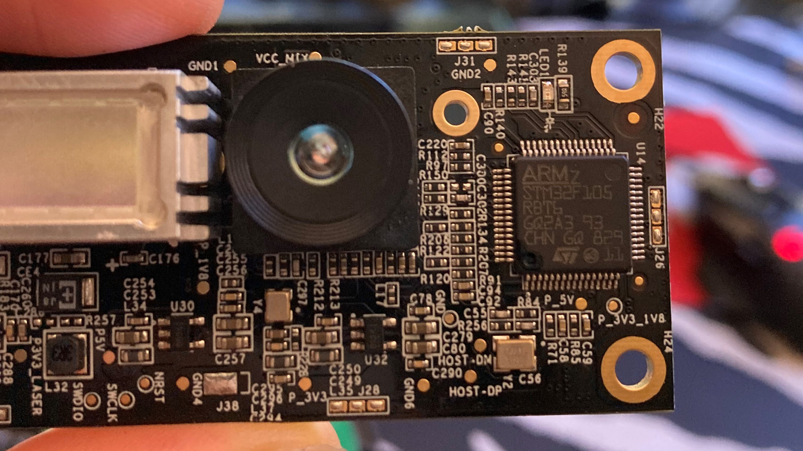
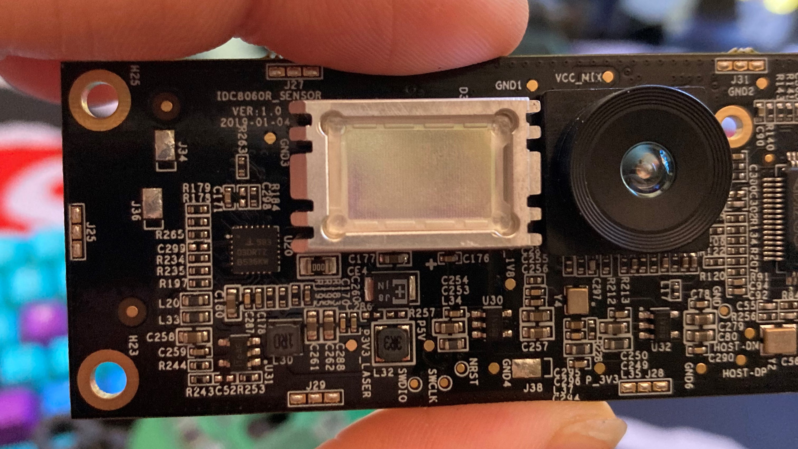
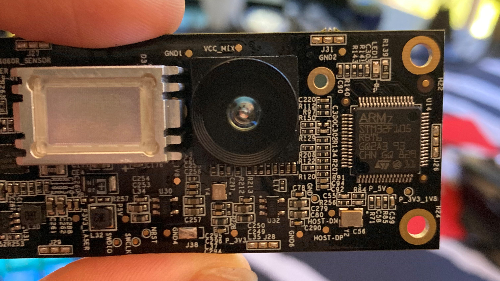
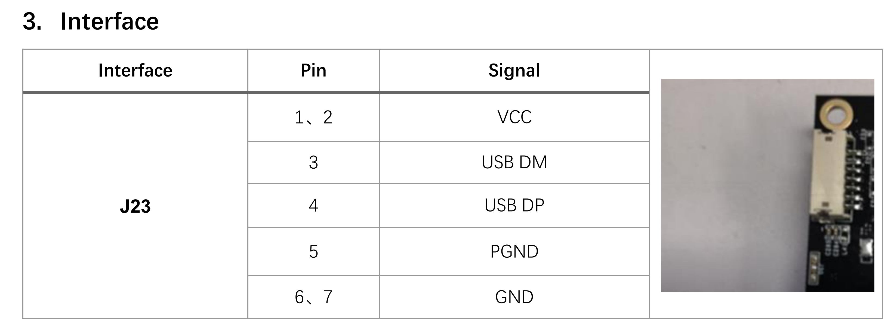
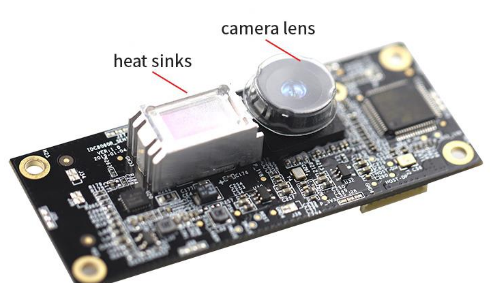
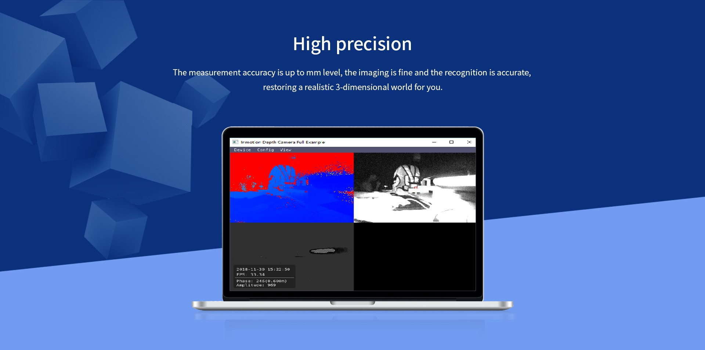

# IC8060 Depth-Camera

For Archival Purpose

Author: [@Tekunalogy](https://github.com/Tekunalogy)

This sensor is designed/manufactured by Ldrobot Co., Ltd.

LDROBOT is a Robotics Sensors company based in Shenzhen, China.

Their website URL at the time of writing this is:
- [LdRobot.com](https://LdRobot.com) - Chinese
- [LdRobot.com/en](https://www.ldrobot.com/en) - English

The following are WayBack Machine Links to the website home page:
- [LdRobot.com](http://web.archive.org/web/20210803032258/https://www.ldrobot.com/) - Chinese
- [LdRobot.com/en](http://web.archive.org/web/20210803032312/https://www.ldrobot.com/en) - English

The following are WayBack Machine links to the product page for the IC8060:
- [CN WayBack Link](http://web.archive.org/web/20210803032447/https://www.ldrobot.com/product/89) - Chinese
- [EN WayBack Link](http://web.archive.org/web/20210803032508/https://www.ldrobot.com/product/en/101) - English

The following are images of the sensor taken by [@EdwardoSunny](https://github.com/EdwardoSunny):

*Depth Camera board attached to the LiDAR/camera mount*

---

*Close up of the flip-side of the board. Features and ARMv7 chip: STM32F105R8T6*

---

*Heatsink removable with screws on the back*

---

*Depth Camera module*

---

Pinout of the 7-Pin connector on board as provided on the [datasheet](IDC8060%20-%20Depth%20Camera%20Datasheet%20-%20EN.pdf).
**[ISSUE](https://github.com/Temi-Robot-Sensors/Depth-Camera/issues/1): Still need a link to the connector that is described as "J23" in datasheet**

---

*Heatsink and Camera Lens pointed out on the [datasheet](IDC8060%20-%20Depth%20Camera%20Datasheet%20-%20EN.pdf)*

---

*Image from the website depicting the camera being used through a software called "Inmotion Depth Camera Full Example".*

*Possible related repository:* [https://github.com/inmoition-depthcamera/sdk](https://github.com/inmoition-depthcamera/sdk)

---
