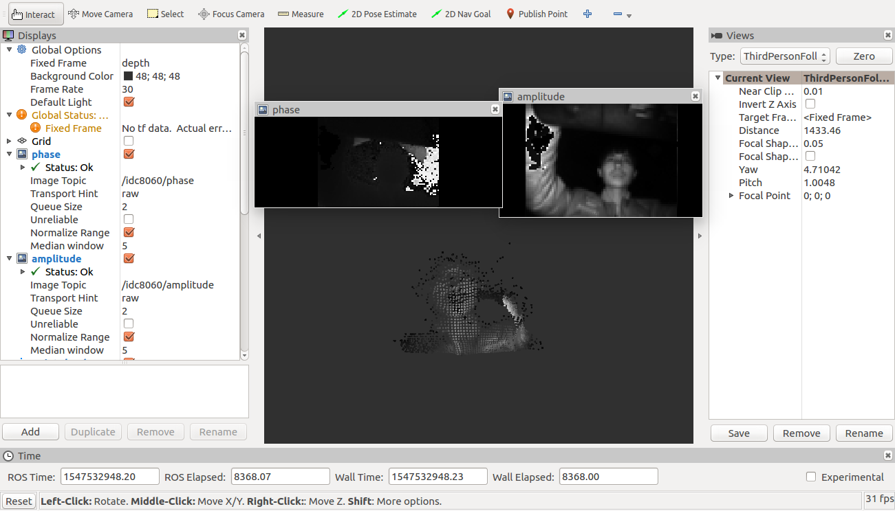
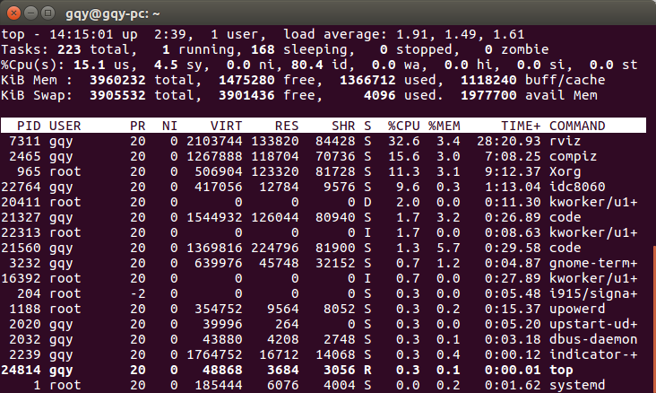

## 环境

1. ubuntu 16.04
2. ros kinetic
3. catkin
4. cmake

## 编译

在TOF_8060目录下，使用 ```catkin_make```

使用

1. 启动roscore

2. 在TOF_8060目录下，执行

   ```sh
   source devel/setup.bash
   rosrun idc8060 idc8060
   ```

    此时应看到如下提示

    

3. 打开另外一个bash，输入rosrun rviz rviz，填入参数如下:

    

    

## CPU 使用率

