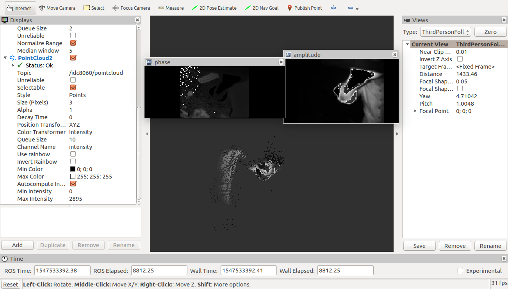

# For Use With ROS
Translated from Chinese to English using Google Translate and minor edits. Original Chinese README file can be found in README-CN.md

## Development Environment

1. Ubuntu 16.04
2. ROS Kinetic
3. Use catkin
4. Use cmake

## Compile

In the TOF_8060 directory, use ```catkin_make```

use

1. Start roscore

2. In the TOF_8060 directory, execute

    ```sh
    source devel/setup.bash
    rosrun idc8060 idc8060
    ```

     You should see the following prompt

     

3. Open another bash, enter rosrun rviz rviz, and fill in the parameters as follows:

     

     

## CPU Usage
